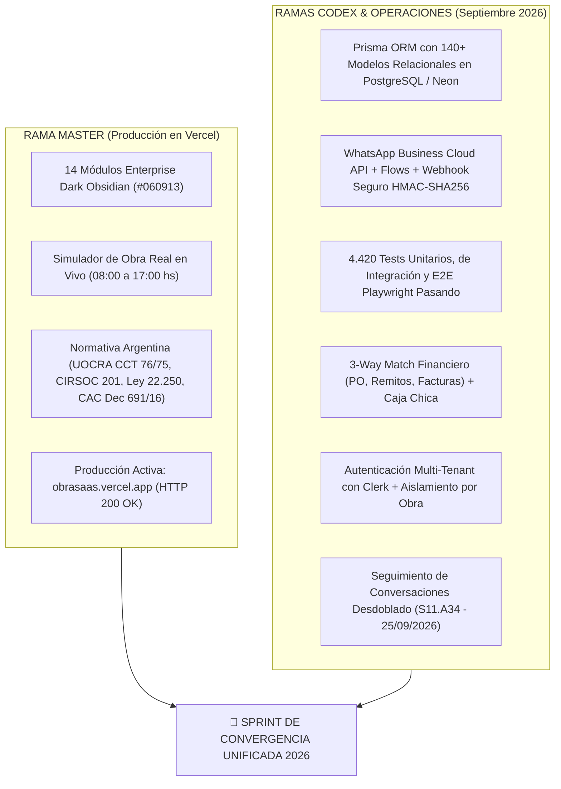
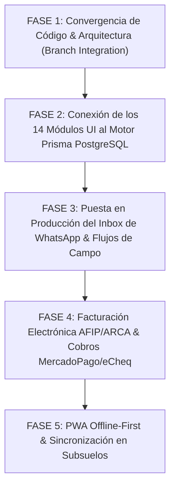

# 🏗️ PLAN MAESTRO DE IMPLEMENTACIÓN UNIFICADO — OBRASAAS ENTERPRISE 2026
> **Documento de Convergencia Estratégica & Operativa para ObraSaaS**  
> **Integración: Producción Vercel + Ramas Codex / ChatGPT + Master Architecture**  
> **Versión:** 3.0 Converged Enterprise  
> **Fecha de Actualización:** 25 de Septiembre de 2026  
> **Repositorio Oficial:** `https://github.com/inguillen87/obrasaas.git`  
> **Producción Activa en Vercel:** [obrasaas.vercel.app](https://obrasaas.vercel.app)

---

## 🧭 1. AUDITORÍA EXHAUSTIVA DEL ESTADO ACTUAL (GITHUB & VERCEL)

A partir del análisis profundo de los repositorios remotos en GitHub y del despliegue en Vercel al 25 de Septiembre de 2026, el sistema se encuentra en un punto histórico con dos grandes fortalezas que deben ser unificadas:



### 🅰️ Lo que ya está construido y validado en `master` (Producción Vercel)
1. **Dashboard & Simulador de Obra Real (`/dashboard`)**:
   - Barra de control cronológica en vivo (08:00 AM a 17:00 PM).
   - 5 roles integrados: Directora de Obra, Compras, Capataz, Operario UOCRA y Cliente/Inversor.
   - Radar satelital GPS con cálculo de geocerca en tiempo real.
   - Credencial digital inteligente con QR, ART y apto médico.
   - Recibo de sueldo UOCRA quincenal con pad de firma táctil y sello SHA-256 (Ley 25.506).
   - Recepción de camión hormigonero con ensayo de Cono de Abrams y remito CAE.
   - Inspección previa de armaduras bajo reglamento CIRSOC 201.
2. **Suite de 14 Módulos Dark Obsidian Completa**:
   - `/certificacion`: Redeterminación paramétrica CAC (Decreto 691/16), 8 rubros, 5% fondo de reparo y acta pericial SHA-256.
   - `/coordinacion`: Lienzo interactivo de fotos de obra georreferenciadas, timeline de incidentes y filtros por gremio.
   - `/ejecutivo`: Centro ejecutivo CEO, Curva S de avance físico vs financiero en SVG, alertas IA y calculadora de ROI.
   - `/compliance`: Gauge SVG de cumplimiento normativo (94/100), 7 categorías ponderadas y audit trail criptográfico.
   - `/licitaciones`: Hub de compras públicas/privadas con 6 pliegos, caución 1% (Ley 13.064) y matriz de oferentes.
   - `/presupuesto`: Presupuestador paramétrico con cómputo de 10 partidas, sliders de markups y despacho WhatsApp.
   - `/marketplace`: Procurement hub con corralones homologados, comparador multioferta con flete y remitos digitales.
   - `/libro-obra`: Folios diarios foliados Ley 22.250, clima, temperatura, cuadrilla, órdenes de servicio y PDF pericial.
   - `/inspecciones`: Checklists QA/QC (CIRSOC 201, SRT 319/99, AEA 90364 y pruebas hidráulicas).
   - `/planos`: Visor 2D vectorial con escala métrica calibrada, nubes de revisión y pines de punch list.
   - `/cronograma`: Gantt Studio CPM con ruta crítica y simulador de lluvia bajo régimen UOCRA.
   - `/bim`: Gemelo digital 3D IFC v4.3 con avance por niveles y slider 4D.
   - `/portal`: Portal del inversor en pozo con certificados auditados y métricas SPI 1.05.

### 🅱️ Lo que ya construyeron Codex y ChatGPT en las ramas de operaciones (`codex/saas-recovery-20260917` y sub-ramas)
1. **Infraestructura de Datos Robusta (Prisma + PostgreSQL)**:
   - **Más de 140 modelos relacionales** en `prisma/schema.prisma` cubriendo toda la empresa constructora.
   - Tablas canónicas: `Organization`, `Supplier`, `PurchaseOrder`, `GoodsReceipt`, `SupplierInvoice`, `InventoryLedgerEntry`, `Task`, `TaskAssignment`, `AttendanceEntry`, `AttendanceSchedule`, `Worker`, `DailyLog`, `ProgressEvidence`, `ProjectCertificateBook`, etc.
   - Scripts de verificación y migración automáticos para asegurar que no haya desfasaje de esquema (*schema drift*).
2. **Motor Transaccional de WhatsApp Business Cloud API & Flows**:
   - Webhook HTTP con validación estricta de firmas HMAC-SHA256 (`signed-webhook-ingress`).
   - Manejo atómico de mensajes, outbox durable y colas con locks para evitar duplicados.
   - Enlace directo de las respuestas de los Flows con registros de asistencia (`AttendanceEntry`) e incidencias de obra (`ProjectSnapshot`).
   - **Inbox Operativo (`/dashboard/inbox`)**: Búsqueda en historial, triaje por severidad, y panel lateral de seguimiento desdoblado del redactor (*Conversation Follow-Up Panel S11.A34* completado el 25/09/2026).
3. **Módulo de Compras & Conciliación Financiera (3-Way Matching)**:
   - Circuito comercial completo: Orden de Compra (`PurchaseOrder`) ➔ Recepción de Materiales (`GoodsReceipt`) ➔ Factura de Proveedor (`SupplierInvoice`).
   - Conciliación automática de tres vías con verificación de tolerancias en cantidades y precios.
   - Libro de Caja Chica (`CashFund`, `CashMovement`) con doble firma para montos elevados.
4. **Protección de Datos & Privacidad Legal**:
   - Control plane de decisiones para derechos ARCO / Habeas Data de los obreros (`DataSubjectDecisionControlPlane`).
   - Almacenamiento privado de recibos de haberes y destinos de pago (CBU/CVU).
5. **Aseguramiento de Calidad de Grado Bancario**:
   - **4.420 tests automatizados** pasando (`node --test`).
   - Suites de Playwright E2E para flujos públicos y autenticados.

---

## 🎯 2. EL DIAGNÓSTICO: ¿POR QUÉ DEBEN CONVERGER?

Actualmente existen dos mundos complementarios:
- **`master`** tiene el producto que el cliente ve, compra y usa en terreno (diseño Dark Obsidian, modales de obra, normativa argentina, 66 capturas de pantalla de validación).
- **`codex/saas-recovery-20260917`** tiene el motor enterprise que procesa los datos reales, la persistencia en PostgreSQL, la integración profunda con Meta WhatsApp y la batería de 4.420 tests.

**El objetivo del nuevo plan es la CONVERGENCIA TOTAL:**  
Montar los 14 módulos de `master` sobre la base de datos relacional y los endpoints reales desarrollados por Codex, para que cada clic en el simulador, cada remito de corralón y cada folio del Libro de Obra impacte de inmediato en PostgreSQL y sincronice con WhatsApp en tiempo real.

---

## 🗺️ 3. NUEVO PLAN MAESTRO DE IMPLEMENTACIÓN (FASES & SPRINTS)



---

### 🧩 FASE 1: CONVERGENCIA DE CÓDIGO & ARQUITECTURA (SPRINT C-1)
**Objetivo:** Integrar en una sola rama canónica los módulos UI de `master` con el core backend de `codex/saas-recovery-20260917`.

#### Tareas Técnicas:
1. **Creación de Rama de Integración:**
   - Crear la rama unificada `release/enterprise-unified-2026`.
   - Incorporar los 140+ modelos de `prisma/schema.prisma` y los controladores en `src/app/api/*`.
   - Preservar las rutas de UI Dark Obsidian de `src/app/*` (`/dashboard`, `/certificacion`, `/coordinacion`, `/ejecutivo`, `/compliance`, `/licitaciones`, `/presupuesto`, `/marketplace`, `/libro-obra`, `/inspecciones`, `/planos`, `/cronograma`, `/bim`, `/portal`).
   - Unificar `@/lib/design-system.js` con las utilidades de branding y Clerk.
2. **Validación de Compilación & Tests:**
   - Ejecutar `prisma generate`.
   - Ejecutar `node --test tests/*.test.js` para asegurar que los 4.420 tests se mantengan en verde.
   - Ejecutar `npm run build` con Next.js Turbopack para asegurar 0 errores de compilación.

---

### 🔌 FASE 2: CONEXIÓN DE LOS 14 MÓDULOS AL MOTOR POSTGRESQL / PRISMA (SPRINT C-2)
**Objetivo:** Reemplazar el estado mock en memoria (`initialAppState`) en los 14 módulos por llamadas API autenticadas que lean y escriban en PostgreSQL.

#### Matriz de Conexión Módulo ➔ Tablas Prisma:

| Módulo UI en `master` | Tabla Principal Prisma | Endpoints Conectados | Funcionalidad en Vivo |
| :--- | :--- | :--- | :--- |
| **Marketplace & Corralones** (`/marketplace`) | `PurchaseOrder`, `GoodsReceipt`, `SupplierInvoice`, `Supplier` | `/api/purchase-orders`, `/api/goods-receipts`, `/api/supplier-invoices` | Generación de orden de compra real, recepción con remito y 3-way match. |
| **Dashboard & Simulador** (`/dashboard`) | `AttendanceEntry`, `Worker`, `WhatsAppFlowSession` | `/api/attendance/control`, `/api/field/workers` | Fichaje GPS de operarios, verificación de ART y firma de recibos en DB. |
| **Libro de Obra Digital** (`/libro-obra`) | `DailyLog`, `ProgressEvidence`, `Incident` | `/api/progress`, `/api/field/reports` | Asiento de folios foliados inmutables con clima y registro de lluvia UOCRA. |
| **Inspecciones QA/QC** (`/inspecciones`) | `InspectionRecord`, `InspectionRevision` | `/api/inspections`, `/api/inspections/[id]` | Checklists CIRSOC 201 y SRT con firma matriculada y sellado SHA-256. |
| **Certificaciones** (`/certificacion`) | `ProjectCertificateBook`, `ProjectCertificatePeriodHead`, `ProjectCertificateLine` | `/api/project-certificates`, `/api/project-certificates/[id]/decision` | Cálculo de redeterminación CAC (Dec 691/16) y retención del 5% persistida. |
| **Presupuestador** (`/presupuesto`) | `BudgetVersion`, `BudgetLine`, `BudgetEntry` | `/api/budgets`, `/api/budget-entries` | Cómputos métricos de partidas con markups y control de versiones de presupuesto. |
| **Cronograma Gantt** (`/cronograma`) | `Task`, `TaskDependency`, `ScheduleBaseline`, `ReplanScenario` | `/api/tasks`, `/api/schedule/baselines`, `/api/replan-scenarios` | Fechas tempranas/tardías, camino crítico CPM y reprogramaciones por clima. |
| **Planos & Punch List** (`/planos`) | `Blueprint`, `ProgressEvidence`, `Incident` | `/api/evidence`, `/api/progress` | Pines de fallas anotados con foto y derivación automática a gremios. |
| **Portal del Inversor** (`/portal`) | `ProjectSnapshot`, `ProjectCertificateOperationReceipt` | `/api/operations/overview` | Transparencia de avance físico/financiero (SPI) y actas aprobadas. |

---

### 📱 FASE 3: DESPLIEGUE DEL INBOX WHATSAPP & OPERACIÓN DE CAMPO (SPRINT C-3)
**Objetivo:** Habilitar el módulo `/dashboard/inbox` en la barra de navegación para que capataces y arquitectos reciban y respondan mensajes de cuadrillas en tiempo real.

#### Tareas Técnicas:
1. **Activar `/dashboard/inbox` en el Navegador de Obra:**
   - Incorporar el componente de bandeja de entrada multi-canal con triaje por severidad (Avisos de cuadrilla, alertas de seguridad, remitos entrantes).
   - Conectar con el **Conversation Follow-Up Panel** (`S11.A34`) para revisar mensajes históricos sin interrumpir el redactor.
2. **Flujos de WhatsApp para Operarios de Obra:**
   - **Flujo 1: Fichaje GPS por WhatsApp:** El obrero envía su ubicación actual y el bot confirma asistencia si está dentro de los 50 metros del perímetro de la obra.
   - **Flujo 2: Foto de Remito de Corralón:** El capataz fotografía el remito en papel; el sistema extrae el número y volumen, y crea el `GoodsReceipt` pendiente de aprobación.
   - **Flujo 3: Alerta de Lluvia / Suspensión Art. 21:** Disparo masivo de plantilla aprobada de WhatsApp notificando la suspensión de jornada con pago garantizado de 2.5 horas.

---

### 🧾 FASE 4: FACTURACIÓN AFIP / ARCA & PASARELA MERCADOPAGO / ECHEQ (SPRINT C-4)
**Objetivo:** Vinculación con los servicios fiscales argentinos y pasarela de cobros electrónicos.

#### Tareas Técnicas:
1. **Validación Fiscal AFIP / ARCA:**
   - Conexión del módulo `/marketplace` y `/certificacion` con el Web Service de Factura Electrónica (`WSFE v1`) y Remito Electrónico de Áridos (`WSMTXCA`).
   - Verificación de CAE oficial y CUIT emisor de las hormigoneras y corralones.
2. **Pasarela de Cobros MercadoPago & eCheq:**
   - Cobro de cuotas parte de fideicomisos en pozo mediante MercadoPago Checkout Pro en `/portal`.
   - Soporte para emisión y endoso de cheques electrónicos diferidos (*eCheq*) a 30 y 60 días para pagos a proveedores en `/marketplace`.

---

### 📶 FASE 5: PWA OFFLINE-FIRST & TRABAJO EN SUBSUELOS (SPRINT C-5)
**Objetivo:** Garantizar la continuidad operativa en subsuelos de hormigón armado, pozos de bombeo y zonas rurales sin cobertura móvil.

#### Tareas Técnicas:
1. **Service Worker & Cache Storage:**
   - Configuración de Workbox para cachear la interfaz de usuario y planos arquitectónicos SVG.
2. **Cola de Mutaciones en IndexedDB:**
   - Almacenamiento local de fichajes de cuadrilla, fotos de avance y folios del libro de obra cuando `navigator.onLine === false`.
3. **Background Sync API:**
   - Despacho automático de la cola acumulada en cuanto el dispositivo recupera conexión 4G/WiFi.

---

## 🤖 4. GUÍA OPERATIVA PARA CHATGPT & CODEX (PROMPT DE ARRANQUE)

Copia y pega este prompt exacto en las sesiones de trabajo con ChatGPT o Codex para que continúen alineados:

```markdown
Hola. Estás actuando como Lead Enterprise Architect de ObraSaaS (https://obrasaas.vercel.app).

Hemos auditado todo el ecosistema al 25 de Septiembre de 2026 y detectamos dos líneas de desarrollo que deben confluir:
1. En 'master': 14 módulos de frontend completos con Dark Obsidian Design System (#060913), simulador en vivo de obra real (08:00-17:00 hs) y cumplimiento legal argentino (UOCRA CCT 76/75, CIRSOC 201, Ley 22.250, Dec 691/16).
2. En las ramas 'codex/saas-recovery-20260917' y 'operations/*': 140+ modelos Prisma en PostgreSQL, WhatsApp Business Cloud API con firmas HMAC-SHA256, bandeja de entrada /dashboard/inbox, 3-way match financiero y 4.420 tests pasando.

DOCUMENTO MAESTRO DE REFERENCIA:
- PLAN_DE_IMPLEMENTACION_CODEX.md (Versión 3.0 Converged Enterprise).

REGLAS DE TRABAJO:
- No romper los 14 módulos de UI existentes.
- Conectar los componentes visuales a las tablas reales de Prisma y endpoints en /api/*.
- Preservar siempre 'npm test' (4.420 tests) y 'npm run build' con 0 errores antes de hacer commit.
- Mantener la terminología constructiva argentina estándar.

Comencemos con la Fase 1 / Sprint C-1: ¿Cómo estructuramos la integración de las rutas y el schema sin generar conflictos?
```
