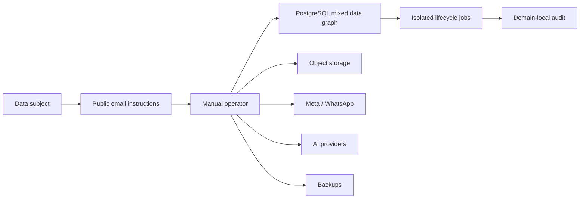

# Security Hardening Proposal: Centralize privacy lifecycle control

## Decision

We need to choose where ObraSaaS will own one consequential statement: whether
we have found, classified and completed every required action for one person's
data without crossing a tenant boundary or destroying evidence that must be
preserved. The choice is not simply how to delete rows. It is how to make an
incomplete result impossible to report as complete.

## Executive Recommendation

The complete option set is:

- **Option 1: Truthful manual intake and domain runbooks.** Correct the public
  contract immediately and use reviewed checklists around existing local jobs.
- **Option 2: Incremental tenant privacy control plane.** Add durable cases,
  read-only discovery manifests, decisions, holds and domain-owned adapters to
  the existing application and Postgres deployment.
- **Option 3: Dedicated privacy orchestration service.** Move orchestration and
  provider authority behind an isolated service and authenticated commands.

I recommend Option 2 under the current product scale. We should include Option
1's public-language correction in its first release and preserve Option 3 as a
future isolation boundary. The immediate implementation slice must stop after
read-only discovery: it can expose gaps safely before we authorize any erasure.

## Evidence

I inspected the source and documents listed below at commit `3f9fe4e`. The
important connection is that each item is manageable alone, but no component
owns completeness across all of them.

| Evidence | Title | What it establishes |
| --- | --- | --- |
| E-PDF | Client construction-app specification | Workers, attendance, payments, documents and field evidence are all first-class product data. |
| E-SCHEMA | Prisma sensitive-data graph | Identity, financial, location, message, media and AI-derived records use mixed delete semantics and untyped JSON. |
| E-PUBLIC | Public deletion instructions | The site states operational and backup timelines that no repository-wide workflow currently proves. |
| E-LOCAL-PURGE | Onboarding transient-retention worker | A bounded `SKIP LOCKED` transaction can erase one encrypted bundle and atomically retain PII-free audit evidence. |
| E-TRACE | Product traceability gate | PRO-05 is explicitly absent and blocks real labour data. |
| E-WA | WhatsApp integration limitations | Raw channel identifiers, messages and backups remain outside the local claim purge. |

Observed: `WorkerPerson` is retained through identity, channel, privacy-choice,
payment and Flow relations; payment and evidence ledgers include database
guards against deletion; conversation, media and progress evidence combine
`CASCADE`, `RESTRICT` and `NO ACTION`; several JSON fields can duplicate
personal data without a typed relation. Observed: the current public page says
active data is scheduled for deletion within 30 days and backups normally
within 90 days, while E-TRACE says the integral workflow is absent.

Inferred: a generic deletion query would either fail on protected evidence,
remove too much through a cascade, or miss untyped and external copies. That
inference follows from the current graph and documented provider boundaries;
it is not a claim that every external provider presently holds every category.

The engineering deadlines and actions must be jurisdiction-aware. Argentina's
[Ley 25.326](https://www.argentina.gob.ar/normativa/nacional/ley-25326-64790/actualizacion)
requires access after identity verification, provides correction and
suppression rights, and also preserves data when a legal duty or legitimate
third-party interest applies. Brazil's official
[LGPD text](https://www.planalto.gov.br/ccivil_03/_ato2015-2018/2018/lei/l13709.htm)
and the EU's
[GDPR](https://eur-lex.europa.eu/eli/reg/2016/679/2016-05-04/eng) likewise
distinguish deletion from restriction, legal preservation and processor
propagation. Counsel must still approve the concrete sector retention matrix.

## Current Design And Failure Mode

Today a requester reaches a public email instruction. An operator would then
have to infer the tenant, subject, data graph, providers, backup state and legal
exceptions manually. Some domains have excellent local invariants, but their
success metrics only describe that domain. A claim purge says nothing about a
WhatsApp message, media blob, GPS event, AI assessment or restored backup.

This is a control-ownership gap. The components closest to each data model are
the right owners of safe mutation, but there is no higher-level owner that can
say which components were required and whether each one reached a verified
terminal state. The public promise therefore has no durable object to point
to, and operations cannot distinguish “finished” from “we did not know this
copy existed.”

## Desired Invariants

- Every case resolves to one organization and one canonical `PlatformUser` or
  `WorkerPerson`; a cross-tenant identifier never broadens scope.
- Identity verification is proportional and recorded without copying full
  identity documents into the case ledger.
- Discovery is read-only, paginated and idempotent. Its manifest contains
  categories, counts, opaque internal references, actions and blockers, never
  ciphertext, full phones, financial coordinates, tokens or provider secrets.
- The manifest is canonical and hash-bound before a decision can refer to it.
- Unknown JSON, storage, log, provider or backup scope is a blocker, not an
  empty result.
- A hold has a concrete basis, owner, bounded scope and review/release event;
  there is no permanent catch-all hold.
- Domain adapters own their mutations and receipts. A central coordinator
  cannot bypass an append-only trigger or rewrite evidence directly.
- Primary database, object storage, provider propagation and backup/tombstone
  replay are separate outcomes.
- “Verified” means all required items are terminal and evidence-backed; partial
  completion stays visible as partial completion.

## Constraints And Non-Goals

We will not derive country-specific labour, tax or litigation periods from
software judgment. We will not let WhatsApp, an AI model, or a public unauthenticated
form trigger destructive execution. We will not store raw request evidence,
financial identifiers or exported personal data in audit metadata. We will not
introduce a second runtime merely to make the architecture look more mature.

The first phase must be additive and reversible, must preserve existing
triggers, and must work with the current PostgreSQL deployment. Throughput is
unknown, so discovery will use bounded pages and remain outside request paths
that process field messages or attendance.

## Before Architecture

The [before diagram](../diagrams/centralize-privacy-lifecycle-control-before.mmd)
shows the missing ownership edge. Manual intake touches several systems, while
each system can only attest to itself.

The critical issue is not the number of boxes. It is that no state machine
binds the subject, required boxes and terminal evidence into one result.

## Options

### Option 1: Truthful manual intake and domain runbooks

The strongest case for Option 1 is speed. We can remove unsupported 30/90-day
technical promises now, state that verified requests are assessed against
applicable duties, and give operators a checklist that treats unknown systems
as unresolved. It preserves every current runtime path and is straightforward
to reverse. For a pre-pilot system with no real worker data, that honesty is a
real security improvement.

The weakness is structural: the checklist has no database-enforced tenant
scope, canonical subject or manifest hash. Operators can produce different
answers on repeated runs, deadlines have no durable clock, and provider or
backup steps can be lost across handoffs. Performance and memory remain
neutral because there is no runtime feature, but reliability and operations
pay through human effort. I would accept this only as an immediate bridge or
for a deliberately data-free demo.

Rollout is a static page and runbook change. Rollback is a normal source revert,
although restoring claims that the system cannot prove would be the wrong
operational choice.

### Option 2: Incremental tenant privacy control plane

Option 2 keeps domain knowledge local while centralizing case truth. A new
PostgreSQL state machine stores the organization, canonical subject, verified
requester, jurisdictional clock and a succession of immutable manifest
versions. Discovery adapters return bounded classifications; the coordinator
canonicalizes and hashes them. Unknown categories remain blockers. Later, a
reviewer chooses an action and basis for each item, evaluates holds, and only
then dispatches an idempotent domain adapter.

The security gain comes from making completeness and authorization durable.
The coordinator is not a superuser deletion utility: it cannot invent an
adapter or bypass its guards. This retains E-LOCAL-PURGE as a good local
primitive. Cross-tenant tests, immutable hashes and per-item terminal states
make accidental scope widening and false global success much harder. Residual
risk remains in catalog drift, untyped JSON and provider semantics, so schema
or integration changes must update the catalog contract and its coverage test.

Discovery adds database queries and manifest rows. Because privacy cases are
asynchronous, we can paginate and rate-limit without affecting WhatsApp or
attendance latency. Peak memory is bounded by page size rather than subject
cardinality; persistent storage grows with manifest items and evidence, which
is appropriate but must itself receive a retention policy. Operationally this
option adds backlog and blocker metrics inside the current deployment instead
of adding a service, queue and second credential set.

Migration can be strictly additive. First deploy case and manifest tables with
execution disabled. Shadow synthetic discovery, compare repeated hashes, and
exercise tenant isolation. Then add human decisions and holds. Each destructive
adapter arrives behind its own gate after legal and technical approval. If a
release misbehaves, we disable discovery/execution, preserve case evidence and
revert callers before considering schema removal.

### Option 3: Dedicated privacy orchestration service

The attractive part of Option 3 is isolation. A dedicated service can hold
provider-scoped credentials, run on a separate release cadence and receive
narrow capabilities instead of ambient application authority. If privacy case
volume becomes material or a separate compliance team owns the process, that
boundary can improve accountability and blast-radius control.

What gives me pause now is that isolation also creates new privileged edges:
service authentication, signed commands, queues, replay protection and
distributed failure reconciliation. The local application still needs every
safe adapter, so a service does not remove the core classification work. It
adds network latency and duplicates runtime and connection-pool memory, which
are acceptable for asynchronous work but unnecessary at current scale.

Reliability becomes a trade rather than an automatic improvement. A provider
outage no longer threatens the web process, but a queued command can be
duplicated, reordered or stranded between databases. We would need shadow
discovery, authenticated capability contracts, outbox/inbox semantics and
fault injection before moving authority. Rollback would route new cases to the
in-application control plane and drain in-flight commands. Option 3 becomes
preferable when organizational separation or credential policy matters more
than the added distributed-systems surface.

## Comparison

| Dimension | Option 1: manual | Option 2: in-application control plane | Option 3: dedicated service |
| --- | --- | --- | --- |
| Security | Honest but operator-dependent | Tenant- and manifest-bound; domain guards retained | Strongest potential isolation; new command boundary |
| Performance | No runtime cost | Bounded async database work | Async network and queue overhead |
| Memory | Neutral | Bounded page allocation plus manifest storage | Duplicate runtime and worker footprint |
| Reliability | Manual handoff and coverage drift | Durable partial state and replay | Better process isolation, harder distributed recovery |
| Operability | High per-case labour | One deployment plus catalog/backlog ownership | Second deployment, secrets, queues and on-call surface |
| Migration | Immediate bridge | Additive, gateable phases | Shadow mode and authority cutover |

The table makes the present decision clear: Option 2 pays complexity exactly
where the missing invariant lives, without importing Option 3's unrelated
deployment complexity. Option 1 remains worth doing inside the first phase,
but cannot be the production end state.

## Recommendation

I recommend Option 2 and would begin with a non-destructive PRO-05A slice:
durable case intake, verified tenant/subject binding, a versioned catalog,
read-only discovery, canonical manifest hashing and explicit blockers. We
should correct the public deletion page in the same change so the external
contract matches current capability.

If the product stays a controlled demo without real labour data, Option 1 can
temporarily win on delivery time. If independent compliance ownership,
credential isolation or case volume becomes a concrete requirement, we should
re-evaluate Option 3 using measured workload and an explicit service threat
model.

## Evidence Coverage And Residual Risk

| Evidence | Option 1 | Option 2 | Option 3 | Residual action |
| --- | --- | --- | --- | --- |
| E-PUBLIC — unsupported timelines | Addressed | Addressed | Addressed | Publish only capabilities we can observe. |
| E-SCHEMA — mixed sensitive graph | Mitigated | Addressed by catalog/adapters | Addressed by service plus adapters | Review every JSON and indirect identifier. |
| E-LOCAL-PURGE — bounded local pattern | Reused manually | Reused as adapter | Reused behind command adapter | Extend only after domain tests. |
| E-TRACE — PRO-05 gate | Unaffected | Progressively mitigated | Progressively mitigated | Keep gate open until provider/backup E2E proof. |
| E-WA — raw/external data | Unresolved | Explicit blocker until adapter | Explicit blocker until adapter | Tokenize raw identifiers and verify Meta actions. |

No option makes legal retention self-defining. Provider receipts can be
incomplete, backups can restore removed values, and a privacy audit ledger can
itself become identifying if it stores excessive metadata. Those risks require
minimal evidence, tombstone replay and reviewed retention for the control plane.

## Migration And Rollout

We will use expand-and-gate phases rather than a flag day:

- PRO-05A adds cases and immutable discovery manifests. It performs no data
  mutation and blocks on unknown scope.
- PRO-05B adds proportional identity verification, decision review, legal holds
  and deadline observability.
- PRO-05C adds one domain adapter at a time, beginning with reversible or
  cryptographic erasure patterns already covered by tests.
- PRO-05D adds storage/provider propagation receipts and backup tombstones,
  followed by a restore drill that reapplies them.

Each phase keeps a fail-closed gate. Rollback disables new work, retains
minimal case evidence, drains any claimed item and reverts application callers.
We do not drop ledger tables or restore sensitive payloads as a rollback.

## Validation Plan

- Apply every migration from zero and over an upgrade fixture in disposable
  PostgreSQL-compatible storage.
- Prove a subject in tenant A cannot discover, reference or influence tenant B.
- Run the same discovery twice and require the same canonical hash when source
  state is unchanged; require a new manifest version when it changes.
- Seed every classified direct relation and require coverage; seed an unknown
  JSON/provider category and require a blocker.
- Scan manifests, audits and API responses for ciphertext, full phone numbers,
  identity numbers, financial values, tokens and signed URLs.
- Inject transaction and provider failures; require idempotent replay and
  visible partial state.
- Restore a backup containing a synthetic erased subject and require tombstone
  replay before ordinary access is re-enabled.
- Run legal/operator tabletop cases for Argentina, Brazil and EU clocks without
  treating a single deadline as universal.

## Implementation Work Packages

- **Case foundation:** typed request/subject/right/status records, tenant-scoped
  actor relations, idempotency, timestamps and minimal append-only audit.
- **Discovery contract:** versioned catalog, domain adapters, bounded manifests,
  canonical hashing, blockers and zero-mutation tests.
- **Decision and hold:** explicit action/basis per item, scoped holds, approvals,
  due-date alerts and immutable decision evidence.
- **Execution:** claimed work items, domain-owned CAS/idempotency, safe retry and
  separate primary/storage/provider outcomes.
- **Restore safety:** deletion tombstones, backup inventory, restore quarantine
  and replay evidence.
- **Product surface:** truthful public instructions and an authenticated admin
  queue/export that redacts third parties.

## Open Questions

- Which party is controller and processor for each data category and contract?
- Which exact retention periods apply to attendance, payroll/payment evidence,
  invoices, safety documents and litigation in each launch country?
- Which storage, logging, messaging, AI and backup subprocessors are active in
  the pilot, and what deletion receipts do they expose?
- Which verified team-owned privacy address replaces the current personal
  mailbox before production?
- What workload would justify moving from Option 2 to Option 3?
